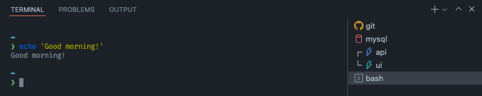

# Terminal Setups

A basic VSCode extension to open up multiple terminals from a configuration.

[Marketplace](https://marketplace.visualstudio.com/items?itemName=linderjohan.terminal-setups)

### Features

- Quickly open multiple integrated terminals from a configuration
- Customize each terminal name, color, icon, opening command
- Supports terminal splits
- Default setup for quick access

### Usage

Command palette


Choose setup


Done



### Setup definition

A terminal setup:

```jsonc
{
	"name": "<Setup name>",
	"default": true // If this terminal should be open with the "Open default terminal"-short hand
	"terminals": [
		{
			"cmd": "<Command sent to the terminal on startup>",
			"color": "<Color>",
			"icon": "<Icon>",
			"name": "<Name>"
		},
		{
			// ... another terminal
		},
		[ // a split
			{
				// ... a terminal in the split
			},
			{
				// ... another terminal in the split
			}
		]
	]
}
```

#### Colors: [Integrated terminal colors](https://code.visualstudio.com/api/references/theme-color#integrated-terminal-colors)

#### Icons: [Built in icons](https://code.visualstudio.com/api/references/icons-in-labels#icon-listing)

Autocomplete for colors and icons are available in settings.json:


### Example:

```jsonc
//settings.json

"terminalSetups": {
		"setups": [
			{
				"name": "Project X",
				"default": true,
				"terminals" : [
					{
						"cmd": "git status",
						"color": "terminal.ansiYellow",
						"icon": "github-inverted",
						"name": "git",
					},
					{
						"color": "terminal.ansiRed",
						"icon": "database",
						"name": "mysql",
					},
					[
						{
							"color": "terminal.ansiBlue",
							"icon": "zap",
							"name": "api",
						},
						{
							"color": "terminal.ansiCyan",
							"icon": "zap",
							"name": "ui",
						},
					],
					{
						"cmd": "Good morning!",
						"color": "terminal.ansiWhite",
						"icon": "terminal",
						"name": "bash",
					},
				]
			},
			{
				"name": "Project Y",
				"terminals": [
					{
						"cmd": "gs",
						"color": "terminal.ansiYellow",
						"icon": "github-inverted",
						"name": "git"
					},
					[
						{
							"color": "terminal.ansiCyan",
							"icon": "database",
							"name": "mysql"
						},
						{
							"color": "terminal.ansiYellow",
							"icon": "database",
							"name": "redis"
						},
					],
					[
						{
							"color": "terminal.ansiBlue",
							"icon": "zap",
							"name": "api"
						},
						{
							"color": "terminal.ansiRed",
							"icon": "zap",
							"name": "worker"
						},
					],
				]
			},
			{
				"name": "Project Z",
				"terminals": [
					{
						"cmd": "gs",
						"color": "terminal.ansiYellow",
						"icon": "github-inverted",
						"name": "git"
					},
					{
						"color": "terminal.ansiCyan",
						"icon": "zap",
						"name": "app"
					}
				]
			},
		]
	},

```
